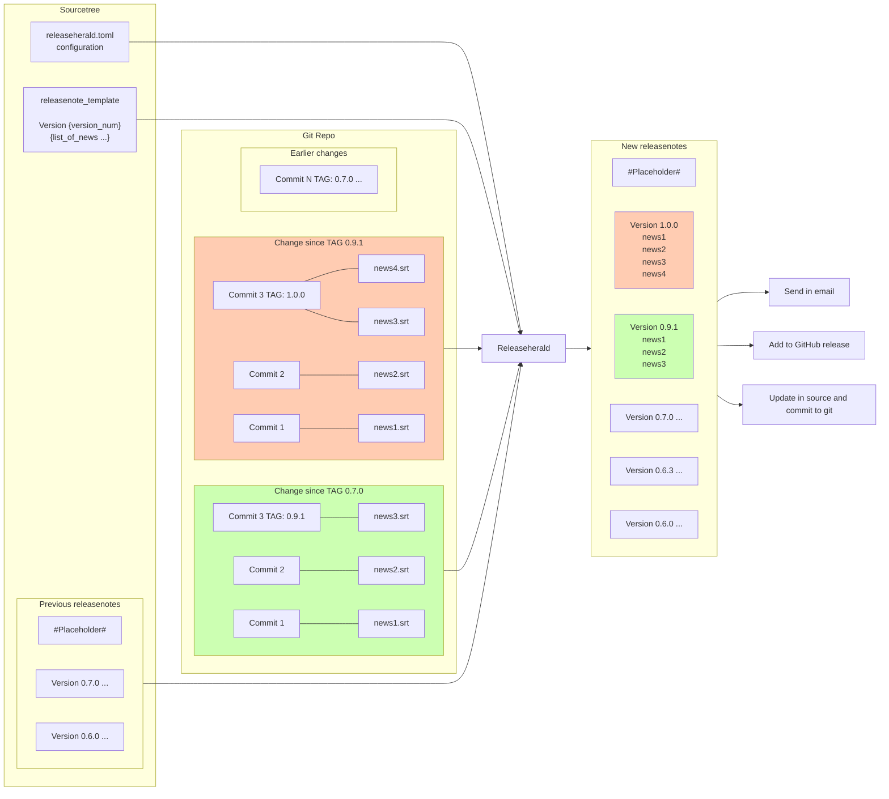

# Introduction

`releaseherald` is a utility that can generate release notes. The only help it needs from
developers is to collect meaningful news fragments in a directory, and apply consistent tags.

We believe releasenotes are an important aspect of a project, they should be convenient to read and easy to work with.
Ideally every pull request should come with an update of the releasenotes, if this
is a single file then one always run into merge conflicts, but if each PR has its own news fragment then this is easily
avoidable. `releaseherald` is designed to be easy to extend, and there are just three guiding principals:

- version control in git
- the release notes for a version is fabricated from the news fragments created/modified between the two release
- the release number can be worked out from git tags

Releaseherald was inspired by [towncrier's philosophy](https://github.com/twisted/towncrier#Philosophy).
    

## Concept

The below diagram explains the concept and shows off the various data that flows into `releaseherald`.



## Install

it can be installed into the python venv

```sh
pip install releaseherald
```

or if you like it better globally, use pipx

```sh
pipx install releaseherald
```

## Basics

`releaseherald` is a command line tool it needs python 3.7+ to run. It needs a config file in the root of the git repo
it should be called `releaseherald.toml`. If it is used in a python project it can read it's configuration
from `pyproject.toml` from `[tool.releaseherald]`. It is possible to start without any configuration, then one needs to
create a `news_fragment` directory in the root of the git repo and a `news.rst` file which should contain a news file
something like this:

```rst
Release Notes
=============

  .. releaseherald_insert
```

As `releaseherald` working with diffs between tags so if no tags yet in the repo just create one
named `RELEASEHERALD_ROOT`. News fragments should be added to the `nesw_fragment` directory, committing them, and
merged (preferably with a pull request). When releasing, a tag need to be created with
following [semantic versioning](https://semver.org/) principles. Once there are some commits and news fragments release
notes can be generated as `releaseherald generate`. This will result something like this:

```rst
Release Notes
=============

.. releaseherald_insert

1.0.0 (2021-10-15)
------------------

* 1, before first release
* 2, before first release
```

This tool try not to have many opinions, so all the above defaults can be tweaked through configuration or command line.
New fragments do not need to be removed between releases, no need to commit the generated release notes either,
as `releaseherald`
works that out from git history, though if that fits better to the workflow it can be done.
